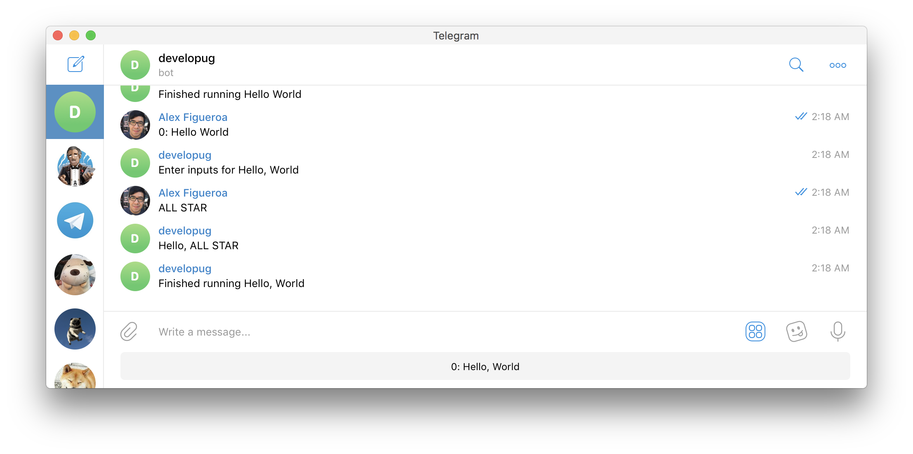
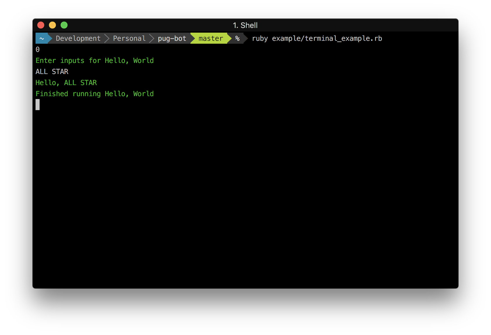
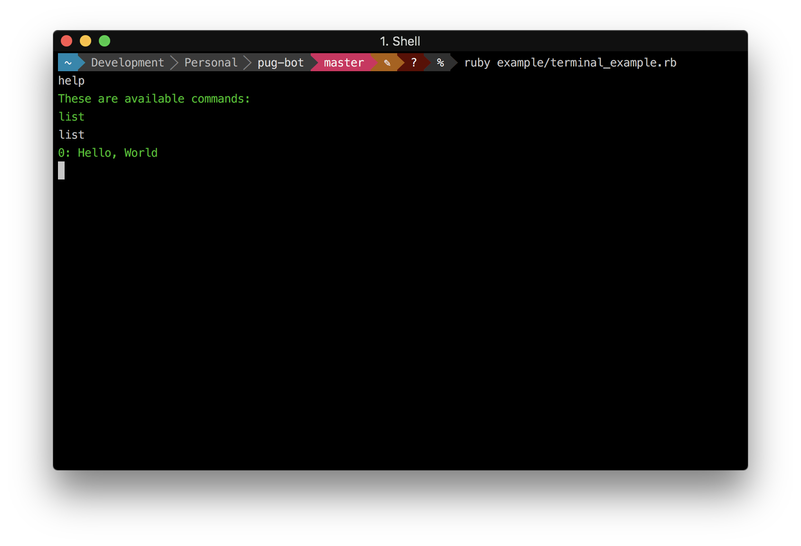

# pug-bot

An automation framework for repetitive dev tasks

# Background

There were a lot of tasks that I found myself repeating during dev work.
I wanted something that was device/editor agnostic and could handle multiline arguments with no hassle.

After playing around with the Telegram API, I hacked together a quick Bot to start this automation.
This is the result of a few weeks of tinkering in hopes of making something more extensible.

You can see how I use this framework [here](https://github.com/ajfigueroa/alex-pug-bot).

# Installation

Add the following to your `Gemfile` and then run `bundle install`

```ruby
gem 'pug-bot'
```

# Usage

Before you can interact with pug-bot, you need to give it something to do via `Action`s

## Action

An `Action` is an abstract representation of a task. This could be anything from
transforming RGB colors in the form: `66, 134, 244` to `4286f4` or pulling reports from
an API to display stock prices.

To define your own action, you need to create a new class which subclasses `Pug::Interfaces::Action` as follows

```ruby
# actions/hello_world_action.rb
require 'pug'

class HelloWorldAction < Pug::Interfaces::Action
end
```

There are a few methods you **must** override specifically `name`, `requires_input?`, and `execute`.
  - `name` helps to identify your `Action`
  - `requires_input?` determines if input is required for your `Action`
  - `execute` is what happens when the `Action` is ran

```ruby
# actions/hello_world_action.rb
require 'pug'

class HelloWorldAction < Pug::Interfaces::Action
  def name
    'Hello, World'
  end

  def requires_input?
    true
  end

  def execute(input)
    "Hello, #{input}"
  end
end
```

Once you've defined your action you just need a way to interact with it.
There are two ways to interact with pug-bot: Telegram and Terminal.

## Telegram Bot Setup

To use Telegram we need to first setup a Telegram Bot. Thankfully, Telegram makes this a nice experience. Skip this and the next section if you want to just use Terminal.

Assuming you already have Telegram installed, you'll need to perform the following steps:
1. Start a new conversation with `@botfather` on Telegram
2. Type `/newbot` and follow its steps to create a new Bot
3. Grab the token for the HTTP API, this is your Telegram API token
4. Start a new conversation with your newly created Bot
5. Visit `https://api.telegram.org/bot<YOUR_BOT_TOKEN>/getUpdates` with `YOUR_BOT_TOKEN` replaced with the token from Step 3.
6. Look for the `id` field in the `chat` body, this is your Telegram Chat ID

## Telegram

To setup Telegram, ensure you have an API token and Chat ID.
Replace `YOUR_TELEGRAM_TOKEN` and `YOUR_TELEGRAM_CHAT_ID` with the token and chat_id for your Bot.

```ruby
require 'pug'
require_relative './actions/hello_world_action'

Pug.configure do |config|
  config.type = Pug::Configuration::TELEGRAM
  config.token = 'YOUR_TELEGRAM_TOKEN'
  config.chat_id = 'YOUR_TELEGRAM_CHAT_ID'
  config.actions = [HelloWorldAction.new]
end

Pug::Bot.run
```

**Note: If you want to interact with Telegram without a script, you'll need to deploy to a server such as Heroku.**


## Terminal

To setup Terminal, you just need to specify the type as Terminal

```ruby
require 'pug'
require_relative './actions/hello_world_action'

Pug.configure do |config|
  config.type = Pug::Configuration::TERMINAL
  config.actions = [HelloWorldAction.new]
end

Pug::Bot.run
```

# Interactions

Every `Action` that pug-bot handles are enumerated. To call your command, you just need to type in the number that it corresponds to.
For the `HelloWorldAction`, that would be `0` as shown below:

## Telegram



## Terminal




# Hints

Hints can be provided via entering: `help` or `list`.


